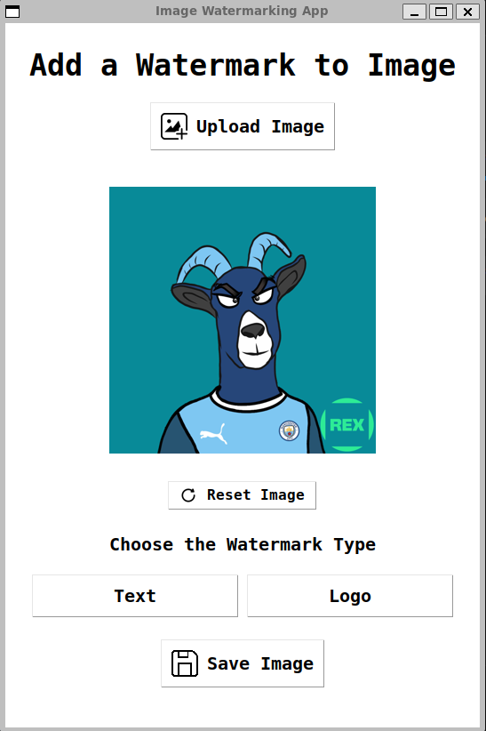

# Image Watermarking GUI App



A simple desktop application built with **Python**, **Tkinter**, and **Pillow** that allows users to upload images and add watermarks in the form of **text** or **logo images**. The app supports choosing watermark positions, customizing text color, previewing, resetting, and saving the final watermarked image.

---

## Features

- Upload any image (PNG, JPG, GIF, BMP, etc.).
- Add a **text watermark** with customizable text, color, and position.
- Add a **logo watermark** from any image file with position selection.
- Preview images and watermarks in real-time with thumbnail resizing.
- Reset image to original (removes watermark).
- Save the final watermarked image in popular formats (PNG, JPG, BMP, GIF).
- User-friendly GUI with icons and buttons for intuitive use.

---

## Screenshots

*Add some screenshots here showing the GUI, upload, watermark, and save dialogs.*

---

## Requirements

- Python 3.6 or higher
- [Pillow](https://python-pillow.org/) library for image processing
- Tkinter (usually comes pre-installed with Python)

---

## Installation

1. Clone this repository or download the source code.

2. (Optional but recommended) Create and activate a Python virtual environment:

   ```bash
   python -m venv venv
   source venv/bin/activate      # macOS/Linux
   venv\Scripts\activate         # Windows
